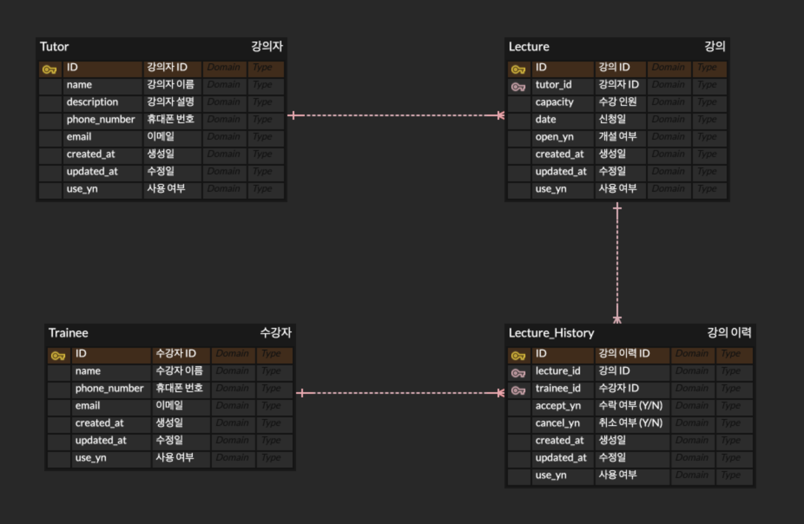

# 수강신청 서비스

---

## ERD 설계.



## ERD 설명
- <b>강의<b> 라는 정보를 보관하기 위한 테이블이 필요해서 Lecture 테이블을 만들었습니다.
- 강의를 수강하는 사용자와 강의를 진행하는 사용자가 필요해서 Tutor와 Trainee 테이블을 만들었습니다.
  - 강의자는 강의를 진행하는 사람이니, 강의 정보와 연관 관계를 맺을 수 있어야한다고 생각했습니다.
- 수강자가 강의를 신청하게 됐을 때, 이에 대한 신청 이력을 보관하기 위해 Lecture_History 테이블을 만들었습니다.
  - 신청 이력 테이블에는 강의 정보와 수강자 정보와 함께 연관 관계를 맺을 수 있어야한다고 생각했습니다.
- 각 관계는 논리적 관계로 설정하게 되었는데, 물리적 연관 관계를 맺을 경우 다음의 이슈가 있기 때문입니다.
  - soft delete 관리의 어려움
  - 외래키 제약이 걸려있는 테이블에 대한 Lock이 걸릴 위험성
  - 연관 관계가 맺어져 있는 테이블에 대한 제거가 어려움

---

## 동시성 통합 테스트
- 지난 과제에서 피드백 받은 CountdownLatch를 통해 개선하여 진행했습니다.

### 어떻게 동시성 제어를 했는가?
- JPA의 Lock을 사용했고, 비관적 락을 사용했습니다.
  - 비관적 락을 상요한 이유는 다음과 같습니다.
    - 낙관적 락을 사용하게 될 경우 동시에 40명이 접근할 경우 튕겨버리게 됩니다.
    - 비관적 락의 경우, 락을 획득할 떄까지 대기하기 때문에 현재 방식에 적합하다고 생각했습니다.
  - 읽기/쓰기 모두 잠금을 강의 조회 쿼리에 걸었습니다.
    - 쓰기 잠금만 걸게 될 경우, 데이터 정합성을 보장할 수 없게 되기 때문입니다.

```kotlin
@Repository
class Repository {
    @Lock(LockModeType.PESSIMISTIC_WRITE)
    override fun findById(lectureId: Long): Optional<LectureEntity>
}
```

### 통합 테스트 방향성
- 강의 수강 인원보다 10 건의 요청이 더 발생하는 상황을 구현햇습니다.
  - 40이라는 숫자는 매직 넘버가 될 수 있기 때문에 강의의 수용 인원 + 10을 더 요청하도록 구현 했습니다.
- 순서를 보장하는지 테스트하기 위해서 성공 케이스와 실패 케이스에 대한 시간을 기록해서 검증하도록 구현했습니다.
- 결과적으로 10건의 추가 요청이 실패하고, 실패 케이스가 10건이 생겼는지 검증하도록 구현했습니다.

```kotlin
class IntegrationTest {
    @Test
    fun test() {
        val LECTURE_ID = 0L
        val beforeEntity = lectureService.getLecture(LectureQueryData(LECTURE_ID))

        val totalRequests = beforeEntity.capacity + 10 // 강의 수용량보다 10개가 많도록 설정
    
        // ...

        // 수강신청한 사용자 ID 리스트 (동기화 리스트로 생성)
        val successfulStudents = Collections.synchronizedList(mutableListOf<Pair<Int, Long>>())
        val failedStudents = Collections.synchronizedList(mutableListOf<Pair<Int, Long>>())

        // 스레드 풀 생성
        val executorService = Executors.newFixedThreadPool(totalRequests)

        // 40개의 요청을 비동기로 생성하여 실행
        for (i in 1..totalRequests) {
            executorService.submit {
                try {
                    // 모든 스레드가 준비될 때까지 대기
                    readyLatch.await()
                    
                    // ...

                    // 수강 신청
                    lectureService.enroll(command)

                    val pair = Pair(i, System.currentTimeMillis())
                    successfulStudents.add(pair)
                } catch (e: LectureCapacityExceededException) {
                    val pair = Pair(i, System.currentTimeMillis())
                    failedStudents.add(pair)
                    errorCnt++
                } finally {
                    // 요청 완료 시 Latch 카운트 감소
                    completeLatch.countDown()
                }
            }
        }
        
        
        // ...

        // 스레드 풀 종료
        executorService.shutdown()

        val afterEntity = lectureService.getLecture(LectureQueryData(LECTURE_ID))

        assertTrue(afterEntity.capacity == 0) // 원래 수용 인원보다 많은 인원이 요청했기 때문에, 수용량은 0이 되어야 한다.
        assertTrue(errorCnt == totalRequests - beforeEntity.capacity) // 실패한 갯수 = 10 (총 스레드 갯수를 수용량 + 10으로 정했기 때문)
        assertTrue(successfulStudents.last().second < failedStudents.first().second) // 현재 테스트가 선착순을 보장하는지 확인.
    }
    
}
```
